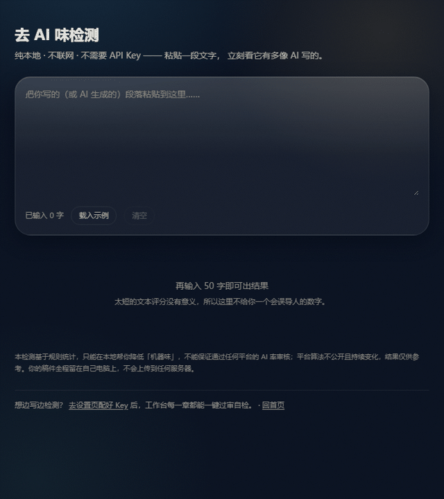

<!-- badges -->
[](LICENSE)
[](https://github.com/huanweide/novel-smith/actions/workflows/ci.yml)
[](https://github.com/huanweide/novel-smith/stargazers)
[](https://novel-forge-nu.vercel.app)
[](https://github.com/huanweide/novel-smith/pulls)
<!-- /badges -->


# Novel Smith — AI 小说工匠

> **中文**：把「写长篇」从体力活变成创意活。  
> **English**: A local-first AI writing workshop for long-form web novels — characters, lore, outlines, and chapters, all in one place.

`TypeScript` · `Local-First` · `分层记忆引擎` · `中文长篇` · `去 AI 味（本地过审）` · `数据不出本机 · 隐私零上传`

[🖼 界面预览](https://novel-forge-nu.vercel.app) · [📦 快速开始](#快速开始) · [📖 English README](README_EN.md) · [⭐ 点 Star 支持](https://github.com/huanweide/novel-smith/stargazers)

**当前版本：v3.1.109** · 本地 SQLite 零配置 · 开箱 17 个示范预设 · 一键导出 5 种格式 · MIT 开源

> **关于在线预览**：上面那个链接只能**看界面长什么样**，点进去做不了实际操作 —— 因为它跑在只读的云环境里，而 Novel Smith 的数据全部要写进本地 SQLite 文件。**完整功能请按下面的「快速开始」在你自己电脑上跑**，两分钟就能起来。

---

## 它解决什么问题

写长篇小说最怕的不是开头，而是**写到一半**——

- 角色越写越多，前面的人设忘了；
- 伏笔埋了没收，设定前后矛盾；
- AI 写到 30 章以后开始"失忆"、越写越水；
- 想不出新剧情，坐在文档前发呆；
- 导出给编辑的 Word 格式一团糟。

Novel Smith 就是要把这些脏活、累活、记不住的活**交给 AI 自动管**，你只管创意和落笔。

---

## 界面实拍

| 首页 · 项目与示例入口 | 探讨模式 · 对话式构建世界观 |
|---|---|
|  |  |

## 60 秒看懂工作流



从「一句话灵感」到「去 AI 味过审」的完整闭环：① 首页开箱即用 → ② 探讨模式对话式构建世界观 → ③ 自动填表建档 → ④ 本地过审自检（段落绿/黄/红评分，稿件不上传）。

---

## 为什么选 Novel Smith

| 你现在的痛苦 | 传统做法 | Novel Smith |
|---|---|---|
| 写到 50 章忘了前面的设定 | 手动翻文档、做 Excel | **自动填表**：每章生成后抽人物/地点/势力 → 自动建角色卡与世界书词条 |
| 角色多了关系理不清 | 自己画图或凭记忆 | **关系图**：节点可拖动、位置记忆、双击开卡 |
| AI 写越长越降智 | 全文硬塞上下文 | **分层记忆引擎**：近 4 章全文 + 近 3 章摘要 + AI 远楼层压缩 |
| 想不出剧情 | 空文档硬想 | **探讨模式 11 步 + 缝合怪推进**：从一句话到完整世界观，主线完结自动续新线 |
| 导出格式乱 | 自己排版 | **一键导出** TXT / Markdown / HTML / EPUB / DOCX |
| 数据在云端、怕隐私泄露 | 依赖第三方服务 | **本地 SQLite**：API Key 与正文全在你电脑上，无需 Docker、无需账号 |

---

## 核心亮点

| 亮点 | 说明 |
|------|------|
| **设定管线（自动填表可选）** | 生成章节后，开启「自动填表」即自动抽结构化表格 → 自动建角色卡/世界书 → 自动检测角色关系 → 自动回写故事线；默认关，纯手写作家不被动打扰 |
| **长篇小说不降智** | 分层记忆引擎：滑动窗口 + AI 远楼层压缩 + S/A/B 四级事件记忆，写 100 章人设/伏笔/设定不丢、不退化 |
| **批量写作两段流** | 一次生成 1-10 章：先出章纲给你改，确认后再后台逐章写正文，可关窗口继续跑 |
| **缝合怪推进** | 主线完结后自动构造承接的新主线，剧情永不干涸；三档节奏（快/均衡/慢热）可调 |
| **角色卡体系** | AI 填满（全字段 + 性格三层 + 故事线 + 关系）、AI 扩展、全选联动、自动分类、自动去重合并 |
| **可拖动关系图** | 角色卡内置「人际关系」列表 + 关系图双视图，节点可拖、位置记忆、双击开卡 |
| **数据自有** | 本地 SQLite 文件库（`./data/novelforge.db`），零配置开箱即用；无云服务、无订阅、无账号 |
| **拆书学习** | 15 维拆解他人作品 + 仿写引擎，越拆越会写 |
| **零门槛开局** | 17 个示范预设、一键示例小说《山海拾遗》、8 题材开局，clone 即用 |
| **世界卡 15 分类体系** | 命运体系/物理/公开体系等 15 类设定模块，确定性分类器自动路由填表 |
| **故事线进度量化** | 主线/支线七要素 + 章节进展百分比，AI 写章实时感知剧情 |
| **本地过审自检（去 AI 味）** | 写完一键跑「去 AI 味」扫描：零联网、零成本、段落级绿/黄/红评分，逐段高亮 AI 腔命中点（套话/堆砌/空洞副词），未发表稿件**全程留本机不上传**，投稿前自己先过一遍 |

---

## 快速开始

> 最省事（推荐）：clone 后只需一行命令，自动完成「生成 .env → 建本地数据库表 → 启动」：
>
> ```bash
> npm run dev:db
> ```
> 浏览器打开 `http://localhost:3001` 即可。

### 手动分步

```bash
git clone https://github.com/huanweide/novel-smith.git
cd novel-smith
cp .env.example .env          # 默认即用本地 SQLite，无需手改
npm install                  # 安装依赖（含 better-sqlite3 预编译二进制）
npm run dev:db               # 建表 + 启动
# 浏览器打开 http://localhost:3001
```

> 数据全部存在 `./data/novelforge.db`（一个本地文件），不依赖任何外部数据库服务。备份就是复制这个文件。  
> `.env` 已被 `.gitignore` 忽略，不会上传 GitHub；API Key 安全。

---

## 零门槛试用：不配 Key 也能先尝一口

还没注册任何 AI 平台、不想先花钱？**可以先体验本项目最有杀伤力的那个功能**：

```bash
npm run dev:db     # 起站后打开：http://localhost:3001/detector
```

**去 AI 味检测**——粘贴一段文字，立刻看到它有多像 AI 写的：

- 一个总分 + 四档等级（基本干净 / 轻微 / 明显 / 严重）；
- 逐段绿 · 黄 · 红色条，**每一处都告诉你「为什么像 AI 写的」和「怎么改」**；
- 六项可解释的原始统计（破折号密度、句长波动、短句占比、AI 词密度……），不是玄学分数。

关键是：**它纯本地跑，不联网、不调模型、不需要 API Key**，你的未发表稿件**一个字节都不出本机**——
这一点是任何云端 AI 检测都做不到的（它们都要求你把稿件传上去）。

觉得好用了，再去「设置」页配 Key，解锁 AI 写作的全部能力。

---

## 功能全景

```
Novel Smith
├── 首页            → 项目管理（创建/删除/概览）
├── 探讨模式         → 对话式构建小说世界（11步骤+抽卡）
├── 工作台           → 核心写作界面
│   ├── 角色管理        → 角色卡 + AI填满/扩展/分类/去重合并 + 关系图
│   ├── 世界书          → 设定词条 + AI 自动补充（触发词注入）
│   ├── 大纲/章节       → 章纲折叠、一键直出正文、章名自动生成
│   ├── 自动填表        → 一键追评所有未填章节（后台运行）
│   ├── 批量写作        → 1-10 章：先生成章纲确认，再后台写正文
│   ├── 故事线          → 主线/支线七要素 + 章节进展时间轴 + 缝合怪推进
│   ├── 智能审阅        → AI 评分诊断 + 合格自动定稿 + 智能交付全书
│   ├── 本地过审自检      → 去 AI 味扫描：段落级绿/黄/红评分 + 逐段命中高亮，稿件不上传
│   └── 工具箱/统计      → 冲突推演、叙事能量曲线、写作监测
├── 拆书系统         → 15维度智能拆解 + 仿写引擎
├── 设置            → LLM 提供商 + API Key + 骨架/配置/记忆衰减
└── 更新公告         → 完整版本历史
```

---

## 模板市集（社区雏形）

想把你的**大纲模板 / 风格卡 / 角色卡**分享给别人？本仓库内置 `templates/` 目录作为起点：

- [`templates/大纲模板.md`](templates/大纲模板.md) — 三幕结构 + 主线七要素 + 卷纲骨架
- [`templates/风格卡模板.md`](templates/风格卡模板.md) — 文风参数 + 禁用写法 + 句式特征
- [`templates/角色卡预设.md`](templates/角色卡预设.md) — 性格三层 + 动机恐惧 + 关系网

复制对应文件、填上你的设定即可直接使用；也欢迎把你的版本发到仓库 **Discussions（模板分享）** 区，让更多人复用。更多「可分享模板」会持续沉淀进这个目录。

---

## 首次使用向导

### 配置 LLM 提供商

1. 点右上角 **设置**
2. 选择 LLM 提供商（推荐 **硅基流动**，国产便宜，DeepSeek 全系可用）
3. 填入你的 API Key
4. 点 **测试连接** → 确认「连接成功」
5. 点 **保存设置**

| 提供商 | 获取 Key 地址 | 价格参考 | 推荐模型 |
|--------|-------------|---------|---------|
| 硅基流动 | [siliconflow.cn](https://siliconflow.cn) | ¥0.001~/1K tokens | `deepseek-ai/DeepSeek-V4-Flash` |
| DeepSeek 官方 | [platform.deepseek.com](https://platform.deepseek.com) | ¥0.002~/1K tokens | `deepseek-v4-flash` |
| OpenAI | [platform.openai.com](https://platform.openai.com) | $0.005~/1K tokens | `gpt-4o` |
| Groq | [console.groq.com](https://console.groq.com) | 免费额度 | `llama-3.3-70b-versatile` |
| 自定义 | 任何 OpenAI 兼容服务 | 看服务商 | 看服务商 |

### 开箱预设与创意工坊

首次打开「创意工坊」会自动播种 **17 个内置示范预设**，点「套用」即可开写，无需手填表。

---

## 技术栈

- **前端框架**：Next.js 16 (App Router) + React 19
- **样式**：Tailwind CSS v4（虚空玻璃设计系统）
- **数据库**：本地 SQLite（better-sqlite3 原生模块）+ Prisma 7
- **API**：Next.js API Routes + SSE 流式响应 + 后台任务表
- **AI**：多提供商 LLM（OpenAI 兼容协议）
- **构建**：Turbopack（开发）/ Webpack（生产）
- **类型检查**：TypeScript strict mode（零错误门禁）

---

## 本地开发

```bash
npm run dev            # 开发服务器 (localhost:3001, Turbopack HMR)
npx tsc --noEmit       # TypeScript 编译检查（零错误才算过）
npx prisma studio      # 数据库可视化管理面板 (localhost:5555)
npx prisma db push     # 同步 Prisma schema → 数据库表
```

---

## 生产部署

```bash
npm run build          # 构建生产版本
npm start              # 启动生产服务器
```

> **公网部署前必读**：应用无内置鉴权。请务必在应用前加一层反向代理鉴权（Basic Auth / Tailscale / 防火墙白名单）。详见仓库安全说明。

---

## 安全与隐私

- API Key 只存本地 SQLite，从未上传任何服务器
- 数据库、正文、设定、导出文件全部在你自己的电脑上
- 无云服务、无遥测、无账号体系
- `.env`、运行时状态、数据库文件、*.pem 全部被 `.gitignore` 忽略
- CI 含安全检查，代码中无硬编码密钥

---

## 贡献与反馈

Novel Smith 是个人开源项目，欢迎一切形式的参与。**想动手？先看 [CONTRIBUTING.md](CONTRIBUTING.md)**——
里面有从零起站、目录结构、三道门禁到「怎么提一个好 Issue」的完整路径。

三步就能参与：

1. **点 Star** —— 最简单也最有用的支持，让项目被更多人看到。
2. **开 Issue** —— 遇到 Bug、想到好功能、文档有错，直接用 Issue 模板提（附版本号 + 复现步骤即可）。
   想聊想法、晒作品、问用法？去仓库的 **Discussions** 区。
3. **提 PR** —— 修 bug、补预设、加特性。改前先 `./scripts/git-snapshot.sh create "说明"` 拍个快照，
   改完跑三道门禁（`tsc` / `vitest` / `next build`）。

> 预设是社区共建的最好素材——你打磨出的好文风 / 世界观 / 角色卡，可以导出 `.preset.json` 分享，
> 或写进 Issue 里，我们很乐意把它变成内置示范预设。也可以直接往 `templates/` 目录提模板。

---

## 赞助支持

如果 Novel Smith 帮你把故事写了出来，可以请作者喝杯奶茶 —— 纯自愿，不影响任何功能。

- **微信扫码**：设置页 → 拉到底部「赞助支持」区块，直接用微信扫
- **GitHub Sponsor**：本仓库主页的 Sponsor 按钮，指向同一张收款码
- 想放自己的收款码？把 `wechat-qr.png` 丢进 `public/sponsor/` 即可（详见 `public/sponsor/README.md`）

> 收款码只是一张「转账入口」图片，不含任何密钥或凭据，纯静态文件，可放心入库。项目不做任何赞助金额或留言的后端收集。

---

## 许可证

MIT License — 详见 [LICENSE](LICENSE)

---

> Novel Smith · AI 小说工坊 · 本地优先 · 数据自有
